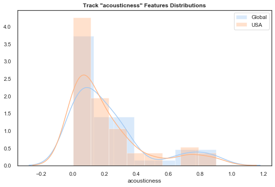
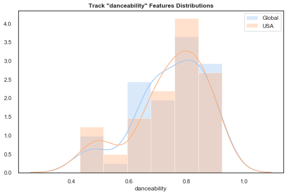
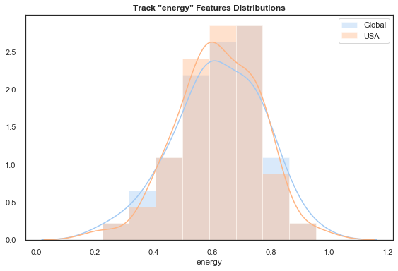
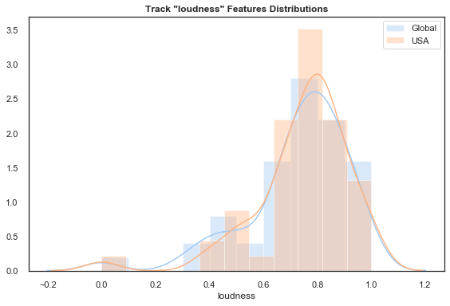
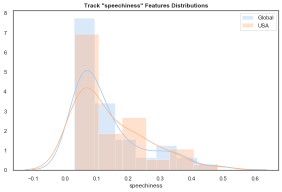

# Creating a Spotify API Web Application to Analyze Taste in Popular Music by Country

Table of Contents

    - Goal
    
    - Questions
    
    - Methods
                 
    - Hypothesis
               
    - Similarity in Track Sets
    
    - Similarity in Genres
    
    - Similarity in Features
    
    - Distribution of Features
    
    - Null Hyothesis Test
    
    - Stones Left Unturned:
        
    - Path Forward:
    
     

# Goal:
#### Explore Spotify's datasets to gain an understanding of the features that their apps use to classify audio tracks and tailor its music reccomendations to users. 
    
# Question: 
#### How similar or different is the popular music in different countries/regions?

# Methods: 
Analyze the current "Top 50" Tracks of the United States, Canada, Mexico, the United Kingdom, and the Globe. Calculate the similarities using the following metrics:
        
        - Similarity in Popular Tracks
        
        - Similarity in Popular Genres
        
        - Similarity in the Features of Popular Music (aka the essential musical/audio
          charachteristics of Popular Tracks)


# Hypothesis: The USA is the country whose "Top 50" tracks are the most similar to those of the Global "Top 50"
                  


```python

```

# Similarity in Track Sets


# Similarity in Genres
Use the scikit.learn vectorization module to take the lists of genres for each playlist and calculate the frequency of each genre. Then, calculate the cosine-similarity between every playlist's genre-vector, and create a similarity matrix. Finally, plot the matrix using a heatmap to visualize which playlists are most similar in their genres. 


```python
Similarity Matrix:
```


<div>
<style scoped>
    .dataframe tbody tr th:only-of-type {
        vertical-align: middle;
    }

    .dataframe tbody tr th {
        vertical-align: top;
    }

    .dataframe thead th {
        text-align: right;
    }
</style>
<table border="1" class="dataframe">
  <thead>
    <tr style="text-align: right;">
      <th></th>
      <th>global</th>
      <th>usa</th>
      <th>uk</th>
      <th>mex</th>
      <th>can</th>
    </tr>
  </thead>
  <tbody>
    <tr>
      <th>global</th>
      <td>1.000000</td>
      <td>0.208407</td>
      <td>-0.863271</td>
      <td>-0.220740</td>
      <td>0.488657</td>
    </tr>
    <tr>
      <th>usa</th>
      <td>0.208407</td>
      <td>1.000000</td>
      <td>-0.363109</td>
      <td>-0.707902</td>
      <td>0.220003</td>
    </tr>
    <tr>
      <th>uk</th>
      <td>-0.863271</td>
      <td>-0.363109</td>
      <td>1.000000</td>
      <td>0.192726</td>
      <td>-0.562035</td>
    </tr>
    <tr>
      <th>mex</th>
      <td>-0.220740</td>
      <td>-0.707902</td>
      <td>0.192726</td>
      <td>1.000000</td>
      <td>-0.660480</td>
    </tr>
    <tr>
      <th>can</th>
      <td>0.488657</td>
      <td>0.220003</td>
      <td>-0.562035</td>
      <td>-0.660480</td>
      <td>1.000000</td>
    </tr>
  </tbody>
</table>
</div>


The heatmap shows us that the two most similar playlists (whose intersection is the darkest shade of blue) are USA and Canada. However, contrary to my prediction, the playlist most similart to the global playlist is Canadas

# Similarity in Features

### Description of Features & Correlation between Features


### Calculate Similarity
Take the mean values for every feature in a playlist. Then, use these vectors to once again calculate the cosine similarity between each playlist.


```python
Cosine Similarity Matrix
```


<div>
<style scoped>
    .dataframe tbody tr th:only-of-type {
        vertical-align: middle;
    }

    .dataframe tbody tr th {
        vertical-align: top;
    }

    .dataframe thead th {
        text-align: right;
    }
</style>
<table border="1" class="dataframe">
  <thead>
    <tr style="text-align: right;">
      <th></th>
      <th>global</th>
      <th>usa</th>
      <th>uk</th>
      <th>mex</th>
      <th>can</th>
    </tr>
  </thead>
  <tbody>
    <tr>
      <th>global</th>
      <td>1.000000</td>
      <td>0.208407</td>
      <td>-0.863271</td>
      <td>-0.220740</td>
      <td>0.488657</td>
    </tr>
    <tr>
      <th>usa</th>
      <td>0.208407</td>
      <td>1.000000</td>
      <td>-0.363109</td>
      <td>-0.707902</td>
      <td>0.220003</td>
    </tr>
    <tr>
      <th>uk</th>
      <td>-0.863271</td>
      <td>-0.363109</td>
      <td>1.000000</td>
      <td>0.192726</td>
      <td>-0.562035</td>
    </tr>
    <tr>
      <th>mex</th>
      <td>-0.220740</td>
      <td>-0.707902</td>
      <td>0.192726</td>
      <td>1.000000</td>
      <td>-0.660480</td>
    </tr>
    <tr>
      <th>can</th>
      <td>0.488657</td>
      <td>0.220003</td>
      <td>-0.562035</td>
      <td>-0.660480</td>
      <td>1.000000</td>
    </tr>
  </tbody>
</table>
</div>


# Distributions of Track Features


### Null Hypothesis: There is no difference in the means of features in the USA and Global Playlists


```python
two_tailed_test(global_df, usa_df, label1='Global', label2='USA', feature='acousticness')
```

    pval = 0.612864976409074
    fail to reject null hypothesis





```python
two_tailed_test(global_df, usa_df, label1='Global', label2='USA', feature='danceability')
```

    pval = 0.9898624889912536
    fail to reject null hypothesis





```python
two_tailed_test(global_df, usa_df, label1='Global', label2='USA', feature='energy')
```

    pval = 0.9966979993191145
    fail to reject null hypothesis





```python
two_tailed_test(global_df, usa_df, label1='Global', label2='USA', feature='loudness')
```

    pval = 0.6585050655009175
    fail to reject null hypothesis





```python
two_tailed_test(global_df, usa_df, label1='Global', label2='USA', feature='speechiness')
```

    pval = 0.7483005130667619
    fail to reject null hypothesis





# Conclusions


```python

```

# Stones Left Unturned:
    
     
        - Which country most INFLUENCES the top 50?
        
        - Which Features most INFLUENCE the top 50
        

# Path Forward:
    
        - Expand the Datasets and use Machine Learning to Predict
          the popularity/ranking of a track.


```python

```
